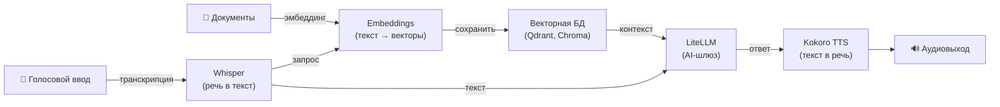

[English](README.md) | [简体中文](README-zh.md) | [繁體中文](README-zh-Hant.md) | [Русский](README-ru.md)

# Скрипт автоматической установки Whisper Speech-to-Text

[](https://github.com/hwdsl2/whisper-install/actions/workflows/main.yml) &nbsp;[](https://opensource.org/licenses/MIT)

Установщик сервера Whisper speech-to-text для Ubuntu, Debian, AlmaLinux, Rocky Linux, CentOS, RHEL и Fedora.

Этот скрипт устанавливает и настраивает самостоятельно размещаемый сервер [Whisper](https://github.com/openai/whisper) speech-to-text API на базе [faster-whisper](https://github.com/SYSTRAN/faster-whisper), предоставляя совместимую с OpenAI конечную точку `/v1/audio/transcriptions`. Транскрибируйте аудиофайлы с помощью любого приложения, поддерживающего OpenAI audio API.

**Возможности:**

- Полностью автоматическая установка сервера Whisper без участия пользователя
- Поддержка интерактивной установки с пользовательскими параметрами
- Поддержка предварительной загрузки моделей и управления сервером
- Совместимая с OpenAI конечная точка `/v1/audio/transcriptions` — переключите любое приложение одной строкой
- Потоковая транскрипция — получайте сегменты через SSE по мере декодирования, не дожидаясь полного файла
- Несколько форматов вывода: `json`, `text`, `verbose_json`, `srt`, `vtt`
- Офлайн/изолированный режим — работа без доступа к интернету с предварительно загруженными моделями (`WHISPER_LOCAL_ONLY`)
- Аудио остаётся на вашем сервере — данные не передаются третьим сторонам
- Установка Whisper как службы systemd с выделенным системным пользователем
- Модели загружаются с HuggingFace и кэшируются в `/var/lib/whisper`

**Также доступно:**

- Docker ИИ/Аудио: [Whisper (STT)](https://github.com/hwdsl2/docker-whisper/blob/main/README-ru.md), [Kokoro (TTS)](https://github.com/hwdsl2/docker-kokoro/blob/main/README-ru.md), [Embeddings](https://github.com/hwdsl2/docker-embeddings/blob/main/README-ru.md), [LiteLLM](https://github.com/hwdsl2/docker-litellm/blob/main/README-ru.md)
- Docker VPN: [WireGuard](https://github.com/hwdsl2/docker-wireguard/blob/main/README-ru.md), [OpenVPN](https://github.com/hwdsl2/docker-openvpn/blob/main/README-ru.md), [IPsec VPN](https://github.com/hwdsl2/docker-ipsec-vpn-server/blob/master/README-ru.md), [Headscale](https://github.com/hwdsl2/docker-headscale/blob/main/README-ru.md)

**Совет:** Whisper, Kokoro, Embeddings и LiteLLM можно [использовать вместе](#использование-с-другими-ai-сервисами) для построения полного приватного AI-стека на вашем собственном сервере.

## Требования

- Linux-сервер (облачный сервер, VPS, выделенный сервер или домашний сервер)
- Python 3.9 или выше (скрипт устанавливает его автоматически на поддерживаемых дистрибутивах)
- Не менее **500 МБ RAM** для модели `base` по умолчанию (см. [таблицу моделей](#доступные-модели))
- Доступ к интернету для первоначальной загрузки модели (после загрузки модель кэшируется локально). Не требуется при использовании `WHISPER_LOCAL_ONLY` с предварительно загруженными моделями.

**Примечание:** Для развёртываний с доступом из интернета настоятельно рекомендуется использовать [обратный прокси](#использование-обратного-прокси) для добавления HTTPS. Установите `WHISPER_API_KEY` в `/etc/whisper/whisper.conf`, если сервер доступен из публичного интернета.

## Установка

Загрузите скрипт на ваш Linux-сервер:

```bash
wget -O whisper.sh https://github.com/hwdsl2/whisper-install/raw/main/whisper-install.sh
```

**Вариант 1:** Автоматическая установка с параметрами по умолчанию.

```bash
sudo bash whisper.sh --auto
```

Устанавливает модель `base` (~145 МБ) на порту `9000`. Модель загружается с HuggingFace при первом запуске.

**Вариант 2:** Автоматическая установка с пользовательскими параметрами.

```bash
sudo bash whisper.sh --auto --model small --port 9000
```

**Вариант 3:** Интерактивная установка с пользовательскими параметрами.

```bash
sudo bash whisper.sh
```

<details>
<summary>
Нажмите здесь, если не удаётся загрузить.
</summary>

Также можно использовать `curl` для загрузки:

```bash
curl -fL -o whisper.sh https://github.com/hwdsl2/whisper-install/raw/main/whisper-install.sh
```

Если загрузить не удаётся, откройте [whisper-install.sh](whisper-install.sh), затем нажмите кнопку `Raw` справа. Нажмите `Ctrl/Cmd+A` для выделения всего, `Ctrl/Cmd+C` для копирования, затем вставьте в любой текстовый редактор.
</details>

<details>
<summary>
Просмотреть справку по использованию скрипта.
</summary>

```
Использование: bash whisper.sh [параметры]

Параметры:

  --showinfo                           показать информацию о сервере (модель, endpoint, API docs)
  --listmodels                         список доступных моделей Whisper с размерами
  --downloadmodel <модель>             предварительно загрузить модель в каталог кэша
  --uninstall                          удалить Whisper и всю конфигурацию
  -y, --yes                            отвечать «да» на все запросы
  -h, --help                           показать это сообщение и выйти

Параметры установки (необязательные):

  --auto                               автоматически установить с параметрами по умолчанию или пользовательскими
  --model      <название>              модель Whisper для использования (по умолчанию: base)
  --port       <число>                 TCP-порт для API-сервера (по умолчанию: 9000)
  --listenaddr [адрес]                 адрес прослушивания (по умолчанию: 0.0.0.0, используйте 127.0.0.1 только для локального доступа)

Доступные модели: tiny, tiny.en, base, base.en, small, small.en,
                  medium, medium.en, large-v1, large-v2, large-v3,
                  large-v3-turbo (или: turbo)
```
</details>

## После установки

При первом запуске скрипт:
1. Устанавливает системные пакеты: `python3`, `python3-venv`, `curl`
2. Создаёт системного пользователя и группу `whisper`
3. Создаёт виртуальное окружение Python в `/opt/whisper/venv`
4. Устанавливает `faster-whisper`, `fastapi`, `uvicorn` и `python-multipart`
5. Записывает конфигурацию в `/etc/whisper/whisper.conf`
6. Устанавливает и запускает службу systemd `whisper`

При первом запуске выбранная модель загружается с HuggingFace. В зависимости от размера модели и скорости сети это может занять несколько минут. Модель кэшируется в `/var/lib/whisper` и повторно используется при последующих запусках.

Проверка статуса службы и просмотр логов:

```bash
sudo systemctl status whisper
sudo journalctl -u whisper -n 50
```

После появления сообщения «Whisper speech-to-text server is ready» транскрибируйте первый аудиофайл:

```bash
curl http://<ip-сервера>:9000/v1/audio/transcriptions \
  -F file=@audio.mp3 -F model=whisper-1
```

**Ответ:**
```json
{"text": "Здесь появится транскрибированный текст."}
```

## Справочник API

API полностью совместим с [конечной точкой транскрипции аудио OpenAI](https://developers.openai.com/api/reference/resources/audio/subresources/transcriptions/methods/create). Любое приложение, уже обращающееся к `https://api.openai.com/v1/audio/transcriptions`, может переключиться на самостоятельно размещаемый сервер, задав:

```
OPENAI_BASE_URL=http://<ip-сервера>:9000
```

### Транскрипция аудио

```
POST /v1/audio/transcriptions
Content-Type: multipart/form-data
```

**Параметры:**

| Параметр | Тип | Обязательный | Описание |
|---|---|---|---|
| `file` | файл | ✅ | Аудиофайл. Поддерживаемые форматы: `mp3`, `mp4`, `m4a`, `wav`, `webm`, `ogg`, `flac` и все другие форматы, поддерживаемые ffmpeg. |
| `model` | строка | ✅ | Передайте `whisper-1` (значение принимается, но всегда используется активная модель). |
| `language` | строка | — | BCP-47 код языка (например, `en`, `fr`, `ru`). Переопределяет `WHISPER_LANGUAGE` для этого запроса. |
| `prompt` | строка | — | Необязательный текст для управления стилем модели или продолжения предыдущего сегмента. |
| `response_format` | строка | — | Формат вывода. По умолчанию: `json`. См. [форматы ответа](#форматы-ответа). Игнорируется при `stream=true`. |
| `temperature` | число с плавающей точкой | — | Температура выборки (0–1). По умолчанию: `0`. |
| `stream` | булево значение | — | Включить SSE-стриминг. При значении `true` сегменты возвращаются как события `text/event-stream` по мере декодирования. По умолчанию: `false`. |

**Пример:**

```bash
curl http://<ip-сервера>:9000/v1/audio/transcriptions \
  -F file=@meeting.m4a \
  -F model=whisper-1 \
  -F language=ru
```

С аутентификацией по API-ключу:

```bash
curl http://<ip-сервера>:9000/v1/audio/transcriptions \
  -H "Authorization: Bearer your-api-key" \
  -F file=@audio.mp3 \
  -F model=whisper-1
```

### Форматы ответа

| `response_format` | Описание |
|---|---|
| `json` | `{"text": "..."}` — по умолчанию, соответствует базовому ответу OpenAI |
| `text` | Простой текст без JSON-обёртки |
| `verbose_json` | Полный JSON с языком, длительностью, временными метками по сегментам и логарифмическими вероятностями |
| `srt` | Формат субтитров SubRip (`.srt`) |
| `vtt` | Формат субтитров WebVTT (`.vtt`) |

**Пример — потоковая передача сегментов по мере декодирования:**

```bash
curl http://<ip-сервера>:9000/v1/audio/transcriptions \
  -F file=@long-audio.mp3 \
  -F model=whisper-1 \
  -F stream=true
```

**SSE-ответ** (одно событие на сегмент, затем финальное событие `done`):

```
data: {"type":"segment","start":0.0,"end":2.4,"text":"Hello, how are you?"}

data: {"type":"segment","start":2.8,"end":5.1,"text":"I'm doing well, thank you."}

data: {"type":"done","text":"Hello, how are you? I'm doing well, thank you."}
```

Первый сегмент обычно приходит в течение 1–3 секунд после загрузки. Каждое событие `segment` включает временные метки `start`/`end` в секундах. Финальное событие `done` содержит полный собранный транскрипт, эквивалентный стандартному ответу `json`.

<details>
<summary><strong>Пример — потоковая передача из браузера с помощью <code>fetch</code></strong></summary>

```javascript
const form = new FormData();
form.append("file", audioBlob, "audio.webm");
form.append("model", "whisper-1");
form.append("stream", "true");

const res = await fetch("http://<ip-сервера>:9000/v1/audio/transcriptions", {
  method: "POST", body: form,
});

const reader = res.body.getReader();
const decoder = new TextDecoder();
let buffer = "";

while (true) {
  const { done, value } = await reader.read();
  if (done) break;
  buffer += decoder.decode(value, { stream: true });
  // SSE-кадры разделяются "\n\n"; разбиваем и обрабатываем полные кадры
  const frames = buffer.split("\n\n");
  buffer = frames.pop(); // сохраняем незавершённый хвостовой кадр
  for (const frame of frames) {
    if (!frame.startsWith("data: ")) continue;
    const event = JSON.parse(frame.slice(6));
    if (event.type === "segment") console.log(event.text);
    if (event.type === "done") console.log("Полный текст:", event.text);
  }
}
```

</details>

**Пример — получение субтитров SRT:**

```bash
curl http://<ip-сервера>:9000/v1/audio/transcriptions \
  -F file=@video.mp4 \
  -F model=whisper-1 \
  -F response_format=srt
```

**Пример — подробный JSON с временными метками:**

```bash
curl http://<ip-сервера>:9000/v1/audio/transcriptions \
  -F file=@audio.mp3 \
  -F model=whisper-1 \
  -F response_format=verbose_json
```

### Список моделей

```
GET /v1/models
```

Возвращает активную модель в формате, совместимом с OpenAI.

```bash
curl http://<ip-сервера>:9000/v1/models
```

### Интерактивная документация API

Интерактивный Swagger UI доступен по адресу:

```
http://<ip-сервера>:9000/docs
```

## Доступные модели

| Название | Диск | RAM (прибл.) | Примечания |
|---|---|---|---|
| `tiny` | ~75 МБ | ~250 МБ | Самая быстрая; низкая точность |
| `tiny.en` | ~75 МБ | ~250 МБ | Только английский |
| `base` | ~145 МБ | ~500 МБ | Хороший баланс — **по умолчанию** |
| `base.en` | ~145 МБ | ~500 МБ | Только английский |
| `small` | ~465 МБ | ~1.5 ГБ | Более высокая точность |
| `small.en` | ~465 МБ | ~1.5 ГБ | Только английский |
| `medium` | ~1.5 ГБ | ~5 ГБ | Высокая точность |
| `medium.en` | ~1.5 ГБ | ~5 ГБ | Только английский |
| `large-v1` | ~3 ГБ | ~10 ГБ | Старая большая модель |
| `large-v2` | ~3 ГБ | ~10 ГБ | Очень высокая точность |
| `large-v3` | ~3 ГБ | ~10 ГБ | Наилучшая точность |
| `large-v3-turbo` | ~1.6 ГБ | ~6 ГБ | Быстрая + высокая точность ⭐ |
| `turbo` | ~1.6 ГБ | ~6 ГБ | Псевдоним для `large-v3-turbo` |

> **Совет:** `large-v3-turbo` обеспечивает точность, близкую к `large-v3`, при примерно вдвое меньших ресурсах. Это рекомендуемый путь обновления с `base` для большинства развёртываний.

**Примечания:**
- Варианты только для английского (`.en`) немного быстрее для английской речи.
- Квантизация INT8 (по умолчанию) снижает использование RAM примерно на 50%.

## Управление Whisper

После установки запустите скрипт снова для управления сервером.

**Показать информацию о сервере:**

```bash
sudo bash whisper.sh --showinfo
```

**Список доступных моделей:**

```bash
sudo bash whisper.sh --listmodels
```

**Предварительная загрузка модели:**

```bash
sudo bash whisper.sh --downloadmodel large-v3-turbo
```

Предварительная загрузка модели позволяет избежать задержки при смене моделей. После загрузки обновите `WHISPER_MODEL` в файле конфигурации и перезапустите службу.

**Удалить Whisper:**

```bash
sudo bash whisper.sh --uninstall
```

Файлы моделей в `/var/lib/whisper` сохраняются. Для их удаления выполните:

```bash
sudo rm -rf /var/lib/whisper
```

**Показать справку:**

```bash
sudo bash whisper.sh --help
```

Также можно запустить скрипт без аргументов для интерактивного меню управления.

## Конфигурация

Файл конфигурации находится по адресу `/etc/whisper/whisper.conf`. Отредактируйте его для изменения настроек, затем перезапустите службу:

```bash
sudo systemctl restart whisper
```

Все переменные необязательны. Если не заданы, значения по умолчанию используются автоматически.

| Переменная | Описание | По умолчанию |
|---|---|---|
| `WHISPER_MODEL` | Модель Whisper для использования. Варианты см. в [таблице моделей](#доступные-модели). | `base` |
| `WHISPER_PORT` | TCP-порт для API-сервера (1–65535). | `9000` |
| `WHISPER_LISTEN_ADDR` | Адрес прослушивания API-сервера. Используйте `0.0.0.0` для всех интерфейсов или `127.0.0.1` только для локального доступа. | `0.0.0.0` |
| `WHISPER_LANGUAGE` | Язык транскрипции по умолчанию. BCP-47 код (например, `en`, `fr`, `ru`) или `auto` для автоопределения. | `auto` |
| `WHISPER_DEVICE` | Вычислительное устройство. | `cpu` |
| `WHISPER_COMPUTE_TYPE` | Тип квантизации. Для CPU рекомендуется `int8`. | `int8` |
| `WHISPER_THREADS` | Потоки CPU для инференса. Установите равным числу физических ядер для минимальной задержки. | `2` |
| `WHISPER_BEAM` | Размер луча для декодирования. Большие значения могут повысить точность за счёт скорости. Используйте `1` для наиболее быстрого (жадного) декодирования. | `5` |
| `WHISPER_API_KEY` | Необязательный Bearer-токен. Если задан, все API-запросы должны содержать `Authorization: Bearer <key>`. | *(не задано)* |
| `WHISPER_LOG_LEVEL` | Уровень логирования: `DEBUG`, `INFO`, `WARNING`, `ERROR`, `CRITICAL`. | `INFO` |
| `WHISPER_LOCAL_ONLY` | При установке любого непустого значения отключает все загрузки моделей с HuggingFace. Для офлайн или изолированных развёртываний с предварительно загруженными моделями. | *(не задано)* |

## Смена модели

1. Предварительно загрузите новую модель (необязательно, но рекомендуется):
   ```bash
   sudo bash whisper.sh --downloadmodel small
   ```
2. Отредактируйте файл конфигурации:
   ```bash
   sudo nano /etc/whisper/whisper.conf
   # Задайте: WHISPER_MODEL=small
   ```
3. Перезапустите службу:
   ```bash
   sudo systemctl restart whisper
   ```

## Использование обратного прокси

Для развёртываний с доступом из интернета разместите обратный прокси перед Whisper для обработки HTTPS-терминации.

**Пример с [Caddy](https://caddyserver.com/docs/)** (автоматический TLS через Let's Encrypt):

```
whisper.example.com {
  reverse_proxy localhost:9000
}
```

**Пример с nginx:**

```nginx
server {
    listen 443 ssl;
    server_name whisper.example.com;

    ssl_certificate     /path/to/cert.pem;
    ssl_certificate_key /path/to/key.pem;

    # Аудиофайлы могут быть большими — увеличьте лимит загрузки при необходимости
    client_max_body_size 100M;

    location / {
        proxy_pass http://127.0.0.1:9000;
        proxy_set_header Host $host;
        proxy_set_header X-Real-IP $remote_addr;
        proxy_set_header X-Forwarded-For $proxy_add_x_forwarded_for;
        proxy_set_header X-Forwarded-Proto $scheme;
        proxy_http_version 1.1;       # требуется для потоковой передачи SSE
        proxy_read_timeout 300s;
    }
}
```

Установите `WHISPER_API_KEY` в `/etc/whisper/whisper.conf`, если сервер доступен из публичного интернета.

## Использование с другими AI-сервисами

Проекты [Whisper (STT)](https://github.com/hwdsl2/docker-whisper/blob/main/README-ru.md), [Embeddings](https://github.com/hwdsl2/docker-embeddings/blob/main/README-ru.md), [LiteLLM](https://github.com/hwdsl2/docker-litellm/blob/main/README-ru.md) и [Kokoro (TTS)](https://github.com/hwdsl2/docker-kokoro/blob/main/README-ru.md) можно объединить для построения полного приватного AI-стека на вашем собственном сервере — от голосового ввода/вывода до RAG-поиска с ответами. Whisper, Kokoro и Embeddings работают полностью локально. При использовании LiteLLM только с локальными моделями (например, Ollama) данные не передаются третьим сторонам. Если вы настроите LiteLLM с внешними провайдерами (например, OpenAI, Anthropic), ваши данные будут переданы этим провайдерам для обработки.



| Сервис | Роль | Порт по умолчанию |
|---|---|---|
| **[Embeddings](https://github.com/hwdsl2/docker-embeddings/blob/main/README-ru.md)** | Преобразует текст в векторы для семантического поиска и RAG | `8000` |
| **[Whisper (STT)](https://github.com/hwdsl2/docker-whisper/blob/main/README-ru.md)** | Транскрибирует речь в текст | `9000` |
| **[LiteLLM](https://github.com/hwdsl2/docker-litellm/blob/main/README-ru.md)** | AI-шлюз — маршрутизирует запросы к OpenAI, Anthropic, Ollama и 100+ другим провайдерам | `4000` |
| **[Kokoro (TTS)](https://github.com/hwdsl2/docker-kokoro/blob/main/README-ru.md)** | Преобразует текст в естественную речь | `8880` |

<details>
<summary><strong>Пример голосового конвейера</strong></summary>

Транскрибируйте речевой вопрос, получите ответ LLM и преобразуйте его в речь:

```bash
# Шаг 1: Транскрибируем аудио в текст (Whisper)
TEXT=$(curl -s http://localhost:9000/v1/audio/transcriptions \
  -F file=@question.mp3 -F model=whisper-1 | jq -r .text)

# Шаг 2: Отправляем текст в LLM и получаем ответ (LiteLLM)
RESPONSE=$(curl -s http://localhost:4000/v1/chat/completions \
  -H "Authorization: Bearer <your-litellm-key>" \
  -H "Content-Type: application/json" \
  -d "{\"model\":\"gpt-4o\",\"messages\":[{\"role\":\"user\",\"content\":\"$TEXT\"}]}" \
  | jq -r '.choices[0].message.content')

# Шаг 3: Преобразуем ответ в речь (Kokoro TTS)
curl -s http://localhost:8880/v1/audio/speech \
  -H "Content-Type: application/json" \
  -d "{\"model\":\"tts-1\",\"input\":\"$RESPONSE\",\"voice\":\"af_heart\"}" \
  --output response.mp3
```

</details>

<details>
<summary><strong>Пример: конвейер RAG</strong></summary>

Индексируйте документы для семантического поиска, затем извлекайте контекст и отвечайте на вопросы с помощью LLM:

```bash
# Шаг 1: Получить вектор фрагмента документа и сохранить его в векторной БД
curl -s http://localhost:8000/v1/embeddings \
  -H "Content-Type: application/json" \
  -d '{"input": "Docker simplifies deployment by packaging apps in containers.", "model": "text-embedding-ada-002"}' \
  | jq '.data[0].embedding'
# → Сохраните возвращённый вектор вместе с исходным текстом в Qdrant, Chroma, pgvector и т.д.

# Шаг 2: При запросе — получить вектор вопроса, найти подходящие фрагменты
#          в векторной БД, затем передать вопрос и контекст в LiteLLM.
curl -s http://localhost:4000/v1/chat/completions \
  -H "Authorization: Bearer <your-litellm-key>" \
  -H "Content-Type: application/json" \
  -d '{
    "model": "gpt-4o",
    "messages": [
      {"role": "system", "content": "Отвечай только на основе предоставленного контекста."},
      {"role": "user", "content": "Что делает Docker?\n\nКонтекст: Docker упрощает развёртывание, упаковывая приложения в контейнеры."}
    ]
  }' \
  | jq -r '.choices[0].message.content'
```

</details>

## Автоматическая установка с пользовательскими параметрами

```bash
sudo bash whisper.sh --auto --model base --port 9000
```

При использовании `--auto` все параметры установки необязательны. Значения по умолчанию: модель `base`, порт `9000`, адрес прослушивания `0.0.0.0`.

## Технические детали

- Поддержка ОС: Ubuntu 22.04+, Debian 11+, AlmaLinux/Rocky/CentOS 9+, RHEL 9+, Fedora
- Среда выполнения: Python 3.9+ (виртуальное окружение в `/opt/whisper/venv`)
- STT-движок: [faster-whisper](https://github.com/SYSTRAN/faster-whisper) с CTranslate2 (INT8 по умолчанию)
- API-фреймворк: [FastAPI](https://fastapi.tiangolo.com/) + [Uvicorn](https://www.uvicorn.org/)
- API-сервер: [`api_server.py`](api_server.py) (устанавливается в `/opt/whisper/api_server.py`)
- Декодирование аудио: [PyAV](https://github.com/PyAV-Org/PyAV) (встроенные библиотеки FFmpeg — системный `ffmpeg` не требуется)
- Каталог данных: `/var/lib/whisper` (кэш моделей, сохраняется при обновлениях)
- Файл конфигурации: `/etc/whisper/whisper.conf`
- Служба: `whisper.service` (systemd, работает от имени выделенного системного пользователя `whisper`)

## Лицензия

Copyright (C) 2026 Lin Song   
Эта работа распространяется под [лицензией MIT](https://opensource.org/licenses/MIT).

**faster-whisper** является Copyright (c) 2023 SYSTRAN, и распространяется под [лицензией MIT](https://github.com/SYSTRAN/faster-whisper/blob/master/LICENSE).

**Whisper** является Copyright (c) 2022 OpenAI, и распространяется под [лицензией MIT](https://github.com/openai/whisper/blob/main/LICENSE).

Данный проект является независимой установкой для Whisper и не связан с OpenAI или SYSTRAN, не одобрен и не спонсируется ими.