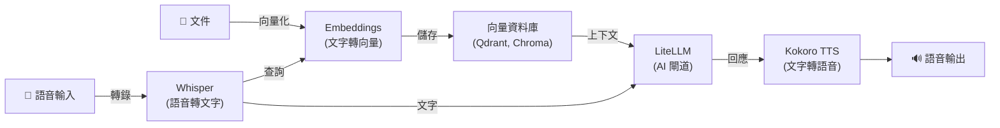

[English](README.md) | [简体中文](README-zh.md) | [繁體中文](README-zh-Hant.md) | [Русский](README-ru.md)

# Whisper 語音轉文字自動安裝腳本

[](https://github.com/hwdsl2/whisper-install/actions/workflows/main.yml) &nbsp;[](https://opensource.org/licenses/MIT)

適用於 Ubuntu、Debian、AlmaLinux、Rocky Linux、CentOS、RHEL 和 Fedora 的 Whisper 語音轉文字伺服器安裝腳本。

本腳本安裝並設定由 [faster-whisper](https://github.com/SYSTRAN/faster-whisper) 驅動的自託管 [Whisper](https://github.com/openai/whisper) 語音轉文字 API 伺服器，提供相容 OpenAI 的 `/v1/audio/transcriptions` 介面。使用任何支援 OpenAI 音訊 API 的應用程式轉錄音訊檔案。

**功能特性：**

- 全自動 Whisper 伺服器安裝，無需使用者輸入
- 支援使用自訂選項進行互動式安裝
- 支援預下載模型和管理伺服器
- 相容 OpenAI 的 `/v1/audio/transcriptions` API 介面 —— 一行更改即可切換任意應用程式
- 串流轉錄 —— 透過 SSE 即時接收解碼片段，無需等待完整檔案
- 多種輸出格式：`json`、`text`、`verbose_json`、`srt`、`vtt`
- 離線/隔離網路模式 —— 使用預快取模型在無網路環境中執行（`WHISPER_LOCAL_ONLY`）
- 音訊保留在你的伺服器上 —— 不向第三方傳送資料
- 將 Whisper 安裝為具有專用系統使用者的 systemd 服務
- 模型從 HuggingFace 下載並快取至 `/var/lib/whisper`

**另提供：**

- Docker AI/音訊：[Whisper (STT)](https://github.com/hwdsl2/docker-whisper/blob/main/README-zh-Hant.md)、[Kokoro (TTS)](https://github.com/hwdsl2/docker-kokoro/blob/main/README-zh-Hant.md)、[Embeddings](https://github.com/hwdsl2/docker-embeddings/blob/main/README-zh-Hant.md)、[LiteLLM](https://github.com/hwdsl2/docker-litellm/blob/main/README-zh-Hant.md)
- Docker VPN：[WireGuard](https://github.com/hwdsl2/docker-wireguard/blob/main/README-zh-Hant.md)、[OpenVPN](https://github.com/hwdsl2/docker-openvpn/blob/main/README-zh-Hant.md)、[IPsec VPN](https://github.com/hwdsl2/docker-ipsec-vpn-server/blob/master/README-zh-Hant.md)、[Headscale](https://github.com/hwdsl2/docker-headscale/blob/main/README-zh-Hant.md)

**提示：** Whisper、Kokoro、Embeddings 和 LiteLLM 可以[結合使用](#與其他-ai-服務配合使用)，在你自己的伺服器上建構完整的私有 AI 技術堆疊。

## 系統需求

- 一台 Linux 伺服器（雲端伺服器、VPS、獨立伺服器或家用伺服器）
- Python 3.9 或更高版本（腳本會在支援的發行版上自動安裝）
- 預設 `base` 模型至少需要 **500 MB RAM**（參見[模型表](#可用模型)）
- 初次下載模型需要網際網路存取（模型下載後會快取到本機）。如果使用 `WHISPER_LOCAL_ONLY` 並已預快取模型，則不需要。

**注：** 對於面向網際網路的部署，強烈建議使用[反向代理](#使用反向代理)新增 HTTPS。當伺服器可從公用網際網路存取時，請在 `/etc/whisper/whisper.conf` 中設定 `WHISPER_API_KEY`。

## 安裝

在你的 Linux 伺服器上下載腳本：

```bash
wget -O whisper.sh https://github.com/hwdsl2/whisper-install/raw/main/whisper-install.sh
```

**選項 1：** 使用預設選項自動安裝。

```bash
sudo bash whisper.sh --auto
```

這將在連接埠 `9000` 上安裝 `base` 模型（約 145 MB）。模型將在首次啟動時從 HuggingFace 下載。

**選項 2：** 使用自訂選項自動安裝。

```bash
sudo bash whisper.sh --auto --model small --port 9000
```

**選項 3：** 使用自訂選項進行互動式安裝。

```bash
sudo bash whisper.sh
```

<details>
<summary>
如果無法下載，請點擊此處。
</summary>

也可使用 `curl` 下載：

```bash
curl -fL -o whisper.sh https://github.com/hwdsl2/whisper-install/raw/main/whisper-install.sh
```

如果仍無法下載，請開啟 [whisper-install.sh](whisper-install.sh)，然後點擊右側的 `Raw` 按鈕。按 `Ctrl/Cmd+A` 全選，`Ctrl/Cmd+C` 複製，然後貼上至你喜歡的編輯器中。
</details>

<details>
<summary>
查看腳本的使用說明。
</summary>

```
用法：bash whisper.sh [選項]

選項：

  --showinfo                           顯示伺服器資訊（模型、介面、API 文件）
  --listmodels                         列出可用的 Whisper 模型名稱和大小
  --downloadmodel <模型>               預下載模型到快取目錄
  --uninstall                          移除 Whisper 及所有設定
  -y, --yes                            對提示自動回答「是」
  -h, --help                           顯示此說明訊息並結束

安裝選項（選用）：

  --auto                               使用預設或自訂選項自動安裝
  --model      <名稱>                  要使用的 Whisper 模型（預設：base）
  --port       <數字>                  API 伺服器的 TCP 連接埠（預設：9000）
  --listenaddr [地址]                  監聽位址（預設：0.0.0.0，使用 127.0.0.1 僅限本機存取）

可用模型：tiny, tiny.en, base, base.en, small, small.en,
          medium, medium.en, large-v1, large-v2, large-v3,
          large-v3-turbo（或：turbo）
```
</details>

## 安裝後

首次執行時，腳本將：
1. 安裝系統套件：`python3`、`python3-venv`、`curl`
2. 建立 `whisper` 系統使用者和群組
3. 在 `/opt/whisper/venv` 建立 Python 虛擬環境
4. 安裝 `faster-whisper`、`fastapi`、`uvicorn` 和 `python-multipart`
5. 將設定寫入 `/etc/whisper/whisper.conf`
6. 安裝並啟動 `whisper` systemd 服務

首次啟動將從 HuggingFace 下載所選模型。根據模型大小和網路速度，這可能需要幾分鐘。模型快取在 `/var/lib/whisper` 中，後續啟動時將重複使用。

查看服務狀態和日誌：

```bash
sudo systemctl status whisper
sudo journalctl -u whisper -n 50
```

看到「Whisper speech-to-text server is ready」後，轉錄你的第一個音訊檔案：

```bash
curl http://<伺服器IP>:9000/v1/audio/transcriptions \
  -F file=@audio.mp3 -F model=whisper-1
```

**回應：**
```json
{"text": "轉錄後的文字顯示在這裡。"}
```

## API 參考

該 API 與 [OpenAI 的音訊轉錄介面](https://developers.openai.com/api/reference/resources/audio/subresources/transcriptions/methods/create)完全相容。任何已呼叫 `https://api.openai.com/v1/audio/transcriptions` 的應用程式，只需設定以下內容即可切換至自託管：

```
OPENAI_BASE_URL=http://<伺服器IP>:9000
```

### 轉錄音訊

```
POST /v1/audio/transcriptions
Content-Type: multipart/form-data
```

**參數：**

| 參數 | 類型 | 必填 | 描述 |
|---|---|---|---|
| `file` | 檔案 | ✅ | 音訊檔案。支援的格式：`mp3`、`mp4`、`m4a`、`wav`、`webm`、`ogg`、`flac` 及所有 ffmpeg 支援的格式。 |
| `model` | 字串 | ✅ | 傳入 `whisper-1`（值被接受，但始終使用目前活躍模型）。 |
| `language` | 字串 | — | BCP-47 語言代碼（例如 `en`、`fr`、`zh`）。覆寫本次請求的 `WHISPER_LANGUAGE` 設定。 |
| `prompt` | 字串 | — | 用於引導模型風格或延續前一片段的選用文字。 |
| `response_format` | 字串 | — | 輸出格式。預設：`json`。參見[回應格式](#回應格式)。當 `stream=true` 時忽略此參數。 |
| `temperature` | 浮點數 | — | 取樣溫度（0–1）。預設：`0`。 |
| `stream` | 布林值 | — | 啟用 SSE 串流傳輸。為 `true` 時，片段以 `text/event-stream` 事件的形式即時返回。預設：`false`。 |

**範例：**

```bash
curl http://<伺服器IP>:9000/v1/audio/transcriptions \
  -F file=@meeting.m4a \
  -F model=whisper-1 \
  -F language=zh
```

使用 API 金鑰驗證：

```bash
curl http://<伺服器IP>:9000/v1/audio/transcriptions \
  -H "Authorization: Bearer your-api-key" \
  -F file=@audio.mp3 \
  -F model=whisper-1
```

### 回應格式

| `response_format` | 描述 |
|---|---|
| `json` | `{"text": "..."}` —— 預設，與 OpenAI 的基本回應一致 |
| `text` | 純文字，無 JSON 封裝 |
| `verbose_json` | 包含語言、時長、逐片段時間戳記和對數機率的完整 JSON |
| `srt` | SubRip 字幕格式（`.srt`） |
| `vtt` | WebVTT 字幕格式（`.vtt`） |

**範例 —— 即時串流接收解碼片段：**

```bash
curl http://<伺服器IP>:9000/v1/audio/transcriptions \
  -F file=@long-audio.mp3 \
  -F model=whisper-1 \
  -F stream=true
```

**SSE 回應**（每個片段一個事件，最後是 `done` 事件）：

```
data: {"type":"segment","start":0.0,"end":2.4,"text":"Hello, how are you?"}

data: {"type":"segment","start":2.8,"end":5.1,"text":"I'm doing well, thank you."}

data: {"type":"done","text":"Hello, how are you? I'm doing well, thank you."}
```

第一個片段通常在上傳後 1–3 秒內到達。每個 `segment` 事件包含以秒為單位的 `start`/`end` 時間戳記。最終的 `done` 事件包含完整的轉錄文字，等同於標準的 `json` 回應。

**範例 —— 在瀏覽器中使用 `fetch` 進行串流傳輸：**

```javascript
const form = new FormData();
form.append("file", audioBlob, "audio.webm");
form.append("model", "whisper-1");
form.append("stream", "true");

const res = await fetch("http://<伺服器IP>:9000/v1/audio/transcriptions", {
  method: "POST", body: form,
});

const reader = res.body.getReader();
const decoder = new TextDecoder();
let buffer = "";

while (true) {
  const { done, value } = await reader.read();
  if (done) break;
  buffer += decoder.decode(value, { stream: true });
  // SSE 框架以 "\n\n" 分隔；拆分並處理完整框架
  const frames = buffer.split("\n\n");
  buffer = frames.pop(); // 保留未完成的尾部框架
  for (const frame of frames) {
    if (!frame.startsWith("data: ")) continue;
    const event = JSON.parse(frame.slice(6));
    if (event.type === "segment") console.log(event.text);
    if (event.type === "done") console.log("完整文字：", event.text);
  }
}
```

**範例 —— 取得 SRT 字幕：**

```bash
curl http://<伺服器IP>:9000/v1/audio/transcriptions \
  -F file=@video.mp4 \
  -F model=whisper-1 \
  -F response_format=srt
```

**範例 —— 取得帶時間戳記的詳細 JSON：**

```bash
curl http://<伺服器IP>:9000/v1/audio/transcriptions \
  -F file=@audio.mp3 \
  -F model=whisper-1 \
  -F response_format=verbose_json
```

### 列出模型

```
GET /v1/models
```

以相容 OpenAI 的格式返回目前活躍模型。

```bash
curl http://<伺服器IP>:9000/v1/models
```

### 互動式 API 文件

互動式 Swagger UI 可透過以下位址存取：

```
http://<伺服器IP>:9000/docs
```

## 可用模型

| 名稱 | 磁碟占用 | RAM（約） | 說明 |
|---|---|---|---|
| `tiny` | ~75 MB | ~250 MB | 最快；準確率較低 |
| `tiny.en` | ~75 MB | ~250 MB | 僅限英語 |
| `base` | ~145 MB | ~500 MB | 良好的平衡 —— **預設** |
| `base.en` | ~145 MB | ~500 MB | 僅限英語 |
| `small` | ~465 MB | ~1.5 GB | 更高準確率 |
| `small.en` | ~465 MB | ~1.5 GB | 僅限英語 |
| `medium` | ~1.5 GB | ~5 GB | 高準確率 |
| `medium.en` | ~1.5 GB | ~5 GB | 僅限英語 |
| `large-v1` | ~3 GB | ~10 GB | 較舊的大型模型 |
| `large-v2` | ~3 GB | ~10 GB | 非常高的準確率 |
| `large-v3` | ~3 GB | ~10 GB | 最高準確率 |
| `large-v3-turbo` | ~1.6 GB | ~6 GB | 速度快 + 高準確率 ⭐ |
| `turbo` | ~1.6 GB | ~6 GB | `large-v3-turbo` 的別名 |

> **提示：** `large-v3-turbo` 的準確率接近 `large-v3`，但資源消耗約為其一半。對於大多數部署場景，它是從 `base` 升級的建議選擇。

**說明：**
- 僅限英語（`.en`）的變體對英語音訊略快。
- INT8 量化（預設）可將 RAM 使用量減少約 50%。

## 管理 Whisper

安裝完成後，再次執行腳本即可管理你的伺服器。

**顯示伺服器資訊：**

```bash
sudo bash whisper.sh --showinfo
```

**列出可用模型：**

```bash
sudo bash whisper.sh --listmodels
```

**預下載模型：**

```bash
sudo bash whisper.sh --downloadmodel large-v3-turbo
```

預下載模型可避免切換模型時的延遲。下載後，更新設定檔中的 `WHISPER_MODEL` 並重新啟動服務。

**解除安裝 Whisper：**

```bash
sudo bash whisper.sh --uninstall
```

`/var/lib/whisper` 中的模型檔案將被保留。如需同時刪除，請執行：

```bash
sudo rm -rf /var/lib/whisper
```

**顯示說明：**

```bash
sudo bash whisper.sh --help
```

也可不帶參數執行腳本以進入互動式管理選單。

## 設定

設定檔位於 `/etc/whisper/whisper.conf`。編輯此檔案更改設定，然後重新啟動服務：

```bash
sudo systemctl restart whisper
```

所有變數均為選用。如未設定，將自動使用預設值。

| 變數 | 描述 | 預設值 |
|---|---|---|
| `WHISPER_MODEL` | 要使用的 Whisper 模型。參見[模型表](#可用模型)了解選項。 | `base` |
| `WHISPER_PORT` | API 伺服器的 TCP 連接埠（1–65535）。 | `9000` |
| `WHISPER_LISTEN_ADDR` | API 伺服器的監聽位址。使用 `0.0.0.0` 監聽所有介面，或 `127.0.0.1` 僅限本機存取。 | `0.0.0.0` |
| `WHISPER_LANGUAGE` | 預設轉錄語言。BCP-47 代碼（例如 `en`、`fr`、`zh`）或 `auto` 自動偵測。 | `auto` |
| `WHISPER_DEVICE` | 運算裝置。 | `cpu` |
| `WHISPER_COMPUTE_TYPE` | 量化類型。建議 CPU 使用 `int8`。 | `int8` |
| `WHISPER_THREADS` | 推理使用的 CPU 執行緒數。設定為實體核心數可獲得最佳延遲。 | `2` |
| `WHISPER_BEAM` | 解碼的束搜尋大小。較大的值可能提高準確率，但會降低速度。使用 `1` 可獲得最快的（貪婪）解碼。 | `5` |
| `WHISPER_API_KEY` | 選用的 Bearer 權杖。設定後，所有 API 請求必須包含 `Authorization: Bearer <key>`。 | *（未設定）* |
| `WHISPER_LOG_LEVEL` | 日誌級別：`DEBUG`、`INFO`、`WARNING`、`ERROR`、`CRITICAL`。 | `INFO` |
| `WHISPER_LOCAL_ONLY` | 設定為任意非空值時，停用所有 HuggingFace 模型下載。適用於使用預快取模型的離線或隔離網路部署。 | *（未設定）* |

## 切換模型

1. 預下載新模型（選用但建議）：
   ```bash
   sudo bash whisper.sh --downloadmodel small
   ```
2. 編輯設定檔：
   ```bash
   sudo nano /etc/whisper/whisper.conf
   # 設定：WHISPER_MODEL=small
   ```
3. 重新啟動服務：
   ```bash
   sudo systemctl restart whisper
   ```

## 使用反向代理

對於面向網際網路的部署，在 Whisper 前放置反向代理以處理 HTTPS 終止。

**使用 [Caddy](https://caddyserver.com/docs/) 的範例**（透過 Let's Encrypt 自動申請 TLS）：

```
whisper.example.com {
  reverse_proxy localhost:9000
}
```

**使用 nginx 的範例：**

```nginx
server {
    listen 443 ssl;
    server_name whisper.example.com;

    ssl_certificate     /path/to/cert.pem;
    ssl_certificate_key /path/to/key.pem;

    # 音訊檔案可能較大 —— 根據需要增加上傳限制
    client_max_body_size 100M;

    location / {
        proxy_pass http://127.0.0.1:9000;
        proxy_set_header Host $host;
        proxy_set_header X-Real-IP $remote_addr;
        proxy_set_header X-Forwarded-For $proxy_add_x_forwarded_for;
        proxy_set_header X-Forwarded-Proto $scheme;
        proxy_http_version 1.1;       # SSE 串流傳輸所需
        proxy_read_timeout 300s;
    }
}
```

當伺服器可從公用網際網路存取時，請在 `/etc/whisper/whisper.conf` 中設定 `WHISPER_API_KEY`。

## 與其他 AI 服務配合使用

[Whisper (STT)](https://github.com/hwdsl2/docker-whisper/blob/main/README-zh-Hant.md)、[Embeddings](https://github.com/hwdsl2/docker-embeddings/blob/main/README-zh-Hant.md)、[LiteLLM](https://github.com/hwdsl2/docker-litellm/blob/main/README-zh-Hant.md) 和 [Kokoro (TTS)](https://github.com/hwdsl2/docker-kokoro/blob/main/README-zh-Hant.md) 專案可以組合使用，在你自己的伺服器上建構完整的私有 AI 技術堆疊 —— 從語音輸入/輸出到檢索增強生成（RAG）。Whisper、Kokoro 和 Embeddings 完全在本地端執行。當 LiteLLM 僅使用本地端模型（例如 Ollama）時，資料不會傳送給第三方。如果你將 LiteLLM 設定為使用外部提供商（例如 OpenAI、Anthropic），你的資料將被傳送至這些提供商處理。



| 服務 | 角色 | 預設連接埠 |
|---|---|---|
| **[Embeddings](https://github.com/hwdsl2/docker-embeddings/blob/main/README-zh-Hant.md)** | 將文字轉換為向量，用於語意搜尋和 RAG | `8000` |
| **[Whisper (STT)](https://github.com/hwdsl2/docker-whisper/blob/main/README-zh-Hant.md)** | 將語音音訊轉錄為文字 | `9000` |
| **[LiteLLM](https://github.com/hwdsl2/docker-litellm/blob/main/README-zh-Hant.md)** | AI 閘道 —— 將請求路由至 OpenAI、Anthropic、Ollama 及 100+ 其他提供商 | `4000` |
| **[Kokoro (TTS)](https://github.com/hwdsl2/docker-kokoro/blob/main/README-zh-Hant.md)** | 將文字轉換為自然語音 | `8880` |

### 語音管道範例

將語音問題轉錄為文字，取得 LLM 回覆，並將其轉換為語音：

```bash
# 第一步：將音訊轉錄為文字（Whisper）
TEXT=$(curl -s http://localhost:9000/v1/audio/transcriptions \
  -F file=@question.mp3 -F model=whisper-1 | jq -r .text)

# 第二步：將文字傳送給 LLM 並取得回覆（LiteLLM）
RESPONSE=$(curl -s http://localhost:4000/v1/chat/completions \
  -H "Authorization: Bearer <your-litellm-key>" \
  -H "Content-Type: application/json" \
  -d "{\"model\":\"gpt-4o\",\"messages\":[{\"role\":\"user\",\"content\":\"$TEXT\"}]}" \
  | jq -r '.choices[0].message.content')

# 第三步：將回覆轉換為語音（Kokoro TTS）
curl -s http://localhost:8880/v1/audio/speech \
  -H "Content-Type: application/json" \
  -d "{\"model\":\"tts-1\",\"input\":\"$RESPONSE\",\"voice\":\"af_heart\"}" \
  --output response.mp3
```

### RAG 檢索增強生成範例

對文件進行向量化以實現語意檢索，並將檢索到的上下文傳送給 LLM 進行問答：

```bash
# 第一步：對文件片段進行向量化並存入向量資料庫
curl -s http://localhost:8000/v1/embeddings \
  -H "Content-Type: application/json" \
  -d '{"input": "Docker simplifies deployment by packaging apps in containers.", "model": "text-embedding-ada-002"}' \
  | jq '.data[0].embedding'
# → 將返回的向量連同原文一起存入 Qdrant、Chroma、pgvector 等向量資料庫。

# 第二步：查詢時，對問題進行向量化並從向量資料庫檢索最相關的文件片段，
#          然後將問題和檢索到的上下文傳送給 LiteLLM 以取得 LLM 回應。
curl -s http://localhost:4000/v1/chat/completions \
  -H "Authorization: Bearer <your-litellm-key>" \
  -H "Content-Type: application/json" \
  -d '{
    "model": "gpt-4o",
    "messages": [
      {"role": "system", "content": "請僅根據所提供的上下文進行回答。"},
      {"role": "user", "content": "Docker 的作用是什麼？\n\n上下文：Docker 通過將應用打包為容器來簡化部署流程。"}
    ]
  }' \
  | jq -r '.choices[0].message.content'
```

## 使用自訂選項自動安裝

```bash
sudo bash whisper.sh --auto --model base --port 9000
```

使用 `--auto` 時，所有安裝選項均為選用。預設值：模型 `base`，連接埠 `9000`，監聽位址 `0.0.0.0`。

## 技術細節

- 作業系統支援：Ubuntu 22.04+、Debian 11+、AlmaLinux/Rocky/CentOS 9+、RHEL 9+、Fedora
- 執行時：Python 3.9+（虛擬環境位於 `/opt/whisper/venv`）
- STT 引擎：[faster-whisper](https://github.com/SYSTRAN/faster-whisper) with CTranslate2（預設 INT8）
- API 框架：[FastAPI](https://fastapi.tiangolo.com/) + [Uvicorn](https://www.uvicorn.org/)
- API 伺服器：[`api_server.py`](api_server.py)（安裝至 `/opt/whisper/api_server.py`）
- 音訊解碼：[PyAV](https://github.com/PyAV-Org/PyAV)（內建 FFmpeg 函式庫 —— 無需系統安裝 `ffmpeg`）
- 資料目錄：`/var/lib/whisper`（模型快取，升級後保留）
- 設定檔：`/etc/whisper/whisper.conf`
- 服務：`whisper.service`（systemd，以專用 `whisper` 系統使用者執行）

## 授權條款

Copyright (C) 2026 Lin Song   
本作品依據 [MIT 授權條款](https://opensource.org/licenses/MIT)授權。

**faster-whisper** 版權歸 SYSTRAN 所有（2023 年），遵循 [MIT 授權條款](https://github.com/SYSTRAN/faster-whisper/blob/master/LICENSE)。

**Whisper** 版權歸 OpenAI 所有（2022 年），遵循 [MIT 授權條款](https://github.com/openai/whisper/blob/main/LICENSE)。

本專案是 Whisper 的獨立安裝程式，與 OpenAI 或 SYSTRAN 無關聯，未獲其背書或贊助。