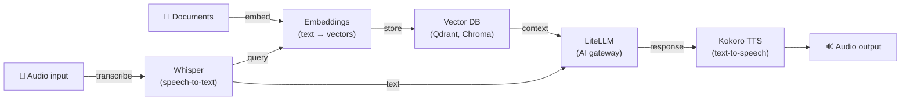

[English](README.md) | [简体中文](README-zh.md) | [繁體中文](README-zh-Hant.md) | [Русский](README-ru.md)

# Whisper Speech-to-Text Auto Setup Script

[](https://github.com/hwdsl2/whisper-install/actions/workflows/main.yml) &nbsp;[](https://opensource.org/licenses/MIT)

Whisper speech-to-text server installer for Ubuntu, Debian, AlmaLinux, Rocky Linux, CentOS, RHEL and Fedora.

This script installs and configures a self-hosted [Whisper](https://github.com/openai/whisper) speech-to-text API server powered by [faster-whisper](https://github.com/SYSTRAN/faster-whisper), providing an OpenAI-compatible `/v1/audio/transcriptions` endpoint. Transcribe audio files using any app that supports the OpenAI audio API.

**Features:**

- Fully automated Whisper server setup, no user input needed
- Supports interactive install using custom options
- Supports pre-downloading models and managing the server
- OpenAI-compatible `/v1/audio/transcriptions` API endpoint — switch any app with a one-line change
- Streaming transcription — receive segments via SSE as they are decoded, with no waiting for the full file
- Multiple output formats: `json`, `text`, `verbose_json`, `srt`, `vtt`
- Offline/air-gapped mode — run without internet access using pre-cached models (`WHISPER_LOCAL_ONLY`)
- Audio stays on your server — no data sent to third parties
- Installs Whisper as a systemd service with a dedicated system user
- Models downloaded from HuggingFace and cached in `/var/lib/whisper`

**Also available:**

- Docker AI/Audio: [Whisper (STT)](https://github.com/hwdsl2/docker-whisper), [Kokoro (TTS)](https://github.com/hwdsl2/docker-kokoro), [Embeddings](https://github.com/hwdsl2/docker-embeddings), [LiteLLM](https://github.com/hwdsl2/docker-litellm)
- Docker VPN: [WireGuard](https://github.com/hwdsl2/docker-wireguard), [OpenVPN](https://github.com/hwdsl2/docker-openvpn), [IPsec VPN](https://github.com/hwdsl2/docker-ipsec-vpn-server), [Headscale](https://github.com/hwdsl2/docker-headscale)

**Tip:** Whisper, Kokoro, Embeddings, and LiteLLM can be [used together](#using-with-other-ai-services) to build a complete, private AI stack on your own server.

## Requirements

- A Linux server (cloud server, VPS, dedicated server or home server)
- Python 3.9 or higher (the script installs it automatically on supported distros)
- At least **500 MB RAM** for the default `base` model (see [model table](#available-models))
- Internet access for the initial model download (the model is cached locally afterwards). Not required if using `WHISPER_LOCAL_ONLY` with pre-cached models.

**Note:** For internet-facing deployments, using a [reverse proxy](#using-a-reverse-proxy) to add HTTPS is **strongly recommended**. Set `WHISPER_API_KEY` in `/etc/whisper/whisper.conf` when the server is accessible from the public internet.

## Installation

Download the script on your Linux server:

```bash
wget -O whisper.sh https://github.com/hwdsl2/whisper-install/raw/main/whisper-install.sh
```

**Option 1:** Auto install with default options.

```bash
sudo bash whisper.sh --auto
```

This installs the `base` model (~145 MB) on port `9000`. The model is downloaded from HuggingFace on first start.

**Option 2:** Auto install with custom options.

```bash
sudo bash whisper.sh --auto --model small --port 9000
```

**Option 3:** Interactive install using custom options.

```bash
sudo bash whisper.sh
```

<details>
<summary>
Click here if you are unable to download.
</summary>

You may also use `curl` to download:

```bash
curl -fL -o whisper.sh https://github.com/hwdsl2/whisper-install/raw/main/whisper-install.sh
```

If you are unable to download, open [whisper-install.sh](whisper-install.sh), then click the `Raw` button on the right. Press `Ctrl/Cmd+A` to select all, `Ctrl/Cmd+C` to copy, then paste into your favorite editor.
</details>

<details>
<summary>
View usage information for the script.
</summary>

```
Usage: bash whisper.sh [options]

Options:

  --showinfo                           show server info (model, endpoint, API docs)
  --listmodels                         list available Whisper model names and sizes
  --downloadmodel <model>              pre-download a model to the cache directory
  --uninstall                          remove Whisper and delete all configuration
  -y, --yes                            assume "yes" as answer to prompts
  -h, --help                           show this help message and exit

Install options (optional):

  --auto                               auto install using default or custom options
  --model      <name>                  Whisper model to use (default: base)
  --port       <number>                TCP port for the API server (default: 9000)
  --listenaddr [address]               listen address (default: 0.0.0.0, use 127.0.0.1 for local only)

Available models: tiny, tiny.en, base, base.en, small, small.en,
                  medium, medium.en, large-v1, large-v2, large-v3,
                  large-v3-turbo (or: turbo)
```
</details>

## After installation

On first run, the script:
1. Installs system packages: `python3`, `python3-venv`, `curl`
2. Creates a `whisper` system user and group
3. Creates a Python virtual environment at `/opt/whisper/venv`
4. Installs `faster-whisper`, `fastapi`, `uvicorn`, and `python-multipart`
5. Writes the configuration to `/etc/whisper/whisper.conf`
6. Installs and starts the `whisper` systemd service

The first start will download the selected model from HuggingFace. This can take several minutes depending on the model size and network speed. The model is cached in `/var/lib/whisper` and reused on subsequent starts.

Check service status and logs:

```bash
sudo systemctl status whisper
sudo journalctl -u whisper -n 50
```

Once you see "Whisper speech-to-text server is ready", transcribe your first audio file:

```bash
curl http://<server-ip>:9000/v1/audio/transcriptions \
  -F file=@audio.mp3 -F model=whisper-1
```

**Response:**
```json
{"text": "Your transcribed text appears here."}
```

## API reference

The API is fully compatible with [OpenAI's audio transcription endpoint](https://developers.openai.com/api/reference/resources/audio/subresources/transcriptions/methods/create). Any application already calling `https://api.openai.com/v1/audio/transcriptions` can switch to self-hosted by setting:

```
OPENAI_BASE_URL=http://<server-ip>:9000
```

### Transcribe audio

```
POST /v1/audio/transcriptions
Content-Type: multipart/form-data
```

**Parameters:**

| Parameter | Type | Required | Description |
|---|---|---|---|
| `file` | file | ✅ | Audio file. Supported formats: `mp3`, `mp4`, `m4a`, `wav`, `webm`, `ogg`, `flac`, and all other formats supported by ffmpeg. |
| `model` | string | ✅ | Pass `whisper-1` (value is accepted but the active model is always used). |
| `language` | string | — | BCP-47 language code (e.g. `en`, `fr`, `zh`). Overrides `WHISPER_LANGUAGE` for this request. |
| `prompt` | string | — | Optional text to guide the model's style or continue a previous segment. |
| `response_format` | string | — | Output format. Default: `json`. See [response formats](#response-formats). Ignored when `stream=true`. |
| `temperature` | float | — | Sampling temperature (0–1). Default: `0`. |
| `stream` | boolean | — | Enable SSE streaming. When `true`, segments are returned as `text/event-stream` events as they are decoded. Default: `false`. |

**Example:**

```bash
curl http://<server-ip>:9000/v1/audio/transcriptions \
  -F file=@meeting.m4a \
  -F model=whisper-1 \
  -F language=en
```

With API key authentication:

```bash
curl http://<server-ip>:9000/v1/audio/transcriptions \
  -H "Authorization: Bearer your-api-key" \
  -F file=@audio.mp3 \
  -F model=whisper-1
```

### Response formats

| `response_format` | Description |
|---|---|
| `json` | `{"text": "..."}` — default, matches OpenAI's basic response |
| `text` | Plain text, no JSON wrapper |
| `verbose_json` | Full JSON with language, duration, per-segment timestamps, log-probabilities |
| `srt` | SubRip subtitle format (`.srt`) |
| `vtt` | WebVTT subtitle format (`.vtt`) |

**Example — stream segments as they are decoded:**

```bash
curl http://<server-ip>:9000/v1/audio/transcriptions \
  -F file=@long-audio.mp3 \
  -F model=whisper-1 \
  -F stream=true
```

**SSE response** (one event per segment, then a final `done` event):

```
data: {"type":"segment","start":0.0,"end":2.4,"text":"Hello, how are you?"}

data: {"type":"segment","start":2.8,"end":5.1,"text":"I'm doing well, thank you."}

data: {"type":"done","text":"Hello, how are you? I'm doing well, thank you."}
```

The first segment typically arrives within 1–3 seconds of upload. Each `segment` event includes `start`/`end` timestamps in seconds. The final `done` event contains the full assembled transcript, equivalent to the standard `json` response.

**Example — stream from a browser using `fetch`:**

```javascript
const form = new FormData();
form.append("file", audioBlob, "audio.webm");
form.append("model", "whisper-1");
form.append("stream", "true");

const res = await fetch("http://<server-ip>:9000/v1/audio/transcriptions", {
  method: "POST", body: form,
});

const reader = res.body.getReader();
const decoder = new TextDecoder();
let buffer = "";

while (true) {
  const { done, value } = await reader.read();
  if (done) break;
  buffer += decoder.decode(value, { stream: true });
  // SSE frames are separated by "\n\n"; split and process complete frames
  const frames = buffer.split("\n\n");
  buffer = frames.pop(); // keep any incomplete trailing frame
  for (const frame of frames) {
    if (!frame.startsWith("data: ")) continue;
    const event = JSON.parse(frame.slice(6));
    if (event.type === "segment") console.log(event.text);
    if (event.type === "done") console.log("Full text:", event.text);
  }
}
```

**Example — get SRT subtitles:**

```bash
curl http://<server-ip>:9000/v1/audio/transcriptions \
  -F file=@video.mp4 \
  -F model=whisper-1 \
  -F response_format=srt
```

**Example — verbose JSON with timestamps:**

```bash
curl http://<server-ip>:9000/v1/audio/transcriptions \
  -F file=@audio.mp3 \
  -F model=whisper-1 \
  -F response_format=verbose_json
```

### List models

```
GET /v1/models
```

Returns the active model in OpenAI-compatible format.

```bash
curl http://<server-ip>:9000/v1/models
```

### Interactive API docs

An interactive Swagger UI is available at:

```
http://<server-ip>:9000/docs
```

## Available models

| Name | Disk | RAM (approx) | Notes |
|---|---|---|---|
| `tiny` | ~75 MB | ~250 MB | Fastest; lower accuracy |
| `tiny.en` | ~75 MB | ~250 MB | English-only variant |
| `base` | ~145 MB | ~500 MB | Good balance — **default** |
| `base.en` | ~145 MB | ~500 MB | English-only variant |
| `small` | ~465 MB | ~1.5 GB | Better accuracy |
| `small.en` | ~465 MB | ~1.5 GB | English-only variant |
| `medium` | ~1.5 GB | ~5 GB | High accuracy |
| `medium.en` | ~1.5 GB | ~5 GB | English-only variant |
| `large-v1` | ~3 GB | ~10 GB | Older large model |
| `large-v2` | ~3 GB | ~10 GB | Very high accuracy |
| `large-v3` | ~3 GB | ~10 GB | Best accuracy |
| `large-v3-turbo` | ~1.6 GB | ~6 GB | Fast + high accuracy ⭐ |
| `turbo` | ~1.6 GB | ~6 GB | Alias for `large-v3-turbo` |

> **Tip:** `large-v3-turbo` offers accuracy close to `large-v3` at roughly half the resource cost. It is the recommended upgrade path from `base` for most deployments.

**Notes:**
- English-only (`.en`) variants are slightly faster for English audio.
- INT8 quantization (default) reduces RAM usage by approximately 50%.

## Managing Whisper

After setup, run the script again to manage your server.

**Show server info:**

```bash
sudo bash whisper.sh --showinfo
```

**List available models:**

```bash
sudo bash whisper.sh --listmodels
```

**Pre-download a model:**

```bash
sudo bash whisper.sh --downloadmodel large-v3-turbo
```

Pre-downloading a model avoids a delay when switching models. After downloading, update `WHISPER_MODEL` in the configuration file and restart the service.

**Remove Whisper:**

```bash
sudo bash whisper.sh --uninstall
```

Model files in `/var/lib/whisper` are preserved. To also remove them:

```bash
sudo rm -rf /var/lib/whisper
```

**Show help:**

```bash
sudo bash whisper.sh --help
```

You may also run the script without arguments for an interactive management menu.

## Configuration

The configuration file is at `/etc/whisper/whisper.conf`. Edit this file to change settings, then restart the service:

```bash
sudo systemctl restart whisper
```

All variables are optional. If not set, defaults are used automatically.

| Variable | Description | Default |
|---|---|---|
| `WHISPER_MODEL` | Whisper model to use. See [model table](#available-models) for options. | `base` |
| `WHISPER_PORT` | TCP port for the API server (1–65535). | `9000` |
| `WHISPER_LISTEN_ADDR` | Listen address for the API server. Use `0.0.0.0` to listen on all interfaces, or `127.0.0.1` for local access only. | `0.0.0.0` |
| `WHISPER_LANGUAGE` | Default transcription language. BCP-47 code (e.g. `en`, `fr`, `zh`) or `auto` to autodetect. | `auto` |
| `WHISPER_DEVICE` | Compute device. | `cpu` |
| `WHISPER_COMPUTE_TYPE` | Quantization type. `int8` is recommended for CPU. | `int8` |
| `WHISPER_THREADS` | CPU threads for inference. Set to the number of physical cores for best latency. | `2` |
| `WHISPER_BEAM` | Beam size for decoding. Higher values may improve accuracy at the cost of speed. Use `1` for fastest (greedy) decoding. | `5` |
| `WHISPER_API_KEY` | Optional Bearer token. If set, all API requests must include `Authorization: Bearer <key>`. | *(not set)* |
| `WHISPER_LOG_LEVEL` | Log level: `DEBUG`, `INFO`, `WARNING`, `ERROR`, `CRITICAL`. | `INFO` |
| `WHISPER_LOCAL_ONLY` | When set to any non-empty value, disables all HuggingFace model downloads. For offline or air-gapped deployments with pre-cached models. | *(not set)* |

## Switching models

1. Pre-download the new model (optional but recommended):
   ```bash
   sudo bash whisper.sh --downloadmodel small
   ```
2. Edit the configuration file:
   ```bash
   sudo nano /etc/whisper/whisper.conf
   # Set: WHISPER_MODEL=small
   ```
3. Restart the service:
   ```bash
   sudo systemctl restart whisper
   ```

## Using a reverse proxy

For internet-facing deployments, place a reverse proxy in front of Whisper to handle HTTPS termination.

**Example with [Caddy](https://caddyserver.com/docs/)** (automatic TLS via Let's Encrypt):

```
whisper.example.com {
  reverse_proxy localhost:9000
}
```

**Example with nginx:**

```nginx
server {
    listen 443 ssl;
    server_name whisper.example.com;

    ssl_certificate     /path/to/cert.pem;
    ssl_certificate_key /path/to/key.pem;

    # Audio files can be large — increase the upload limit as needed
    client_max_body_size 100M;

    location / {
        proxy_pass http://127.0.0.1:9000;
        proxy_set_header Host $host;
        proxy_set_header X-Real-IP $remote_addr;
        proxy_set_header X-Forwarded-For $proxy_add_x_forwarded_for;
        proxy_set_header X-Forwarded-Proto $scheme;
        proxy_http_version 1.1;       # required for chunked streaming (SSE)
        proxy_read_timeout 300s;
    }
}
```

Set `WHISPER_API_KEY` in `/etc/whisper/whisper.conf` when the server is accessible from the public internet.

## Using with other AI services

The [Whisper (STT)](https://github.com/hwdsl2/docker-whisper), [Embeddings](https://github.com/hwdsl2/docker-embeddings), [LiteLLM](https://github.com/hwdsl2/docker-litellm), and [Kokoro (TTS)](https://github.com/hwdsl2/docker-kokoro) projects can be combined to build a complete, private AI stack on your own server — from voice I/O to RAG-powered question answering. Whisper, Kokoro, and Embeddings run fully locally. When using LiteLLM with local models only (e.g., Ollama), no data is sent to third parties. If you configure LiteLLM with external providers (e.g., OpenAI, Anthropic), your data will be sent to those providers.



| Service | Role | Default port |
|---|---|---|
| **[Embeddings](https://github.com/hwdsl2/docker-embeddings)** | Converts text to vectors for semantic search and RAG | `8000` |
| **[Whisper (STT)](https://github.com/hwdsl2/docker-whisper)** | Transcribes spoken audio to text | `9000` |
| **[LiteLLM](https://github.com/hwdsl2/docker-litellm)** | AI gateway — routes requests to OpenAI, Anthropic, Ollama, and 100+ other providers | `4000` |
| **[Kokoro (TTS)](https://github.com/hwdsl2/docker-kokoro)** | Converts text to natural-sounding speech | `8880` |

### Voice pipeline example

Transcribe a spoken question, get an LLM response, and convert it to speech:

```bash
# Step 1: Transcribe audio to text (Whisper)
TEXT=$(curl -s http://localhost:9000/v1/audio/transcriptions \
  -F file=@question.mp3 -F model=whisper-1 | jq -r .text)

# Step 2: Send text to an LLM and get a response (LiteLLM)
RESPONSE=$(curl -s http://localhost:4000/v1/chat/completions \
  -H "Authorization: Bearer <your-litellm-key>" \
  -H "Content-Type: application/json" \
  -d "{\"model\":\"gpt-4o\",\"messages\":[{\"role\":\"user\",\"content\":\"$TEXT\"}]}" \
  | jq -r '.choices[0].message.content')

# Step 3: Convert the response to speech (Kokoro TTS)
curl -s http://localhost:8880/v1/audio/speech \
  -H "Content-Type: application/json" \
  -d "{\"model\":\"tts-1\",\"input\":\"$RESPONSE\",\"voice\":\"af_heart\"}" \
  --output response.mp3
```

### RAG pipeline example

Embed documents for semantic search, then retrieve context and answer questions with an LLM:

```bash
# Step 1: Embed a document chunk and store the vector in your vector DB
curl -s http://localhost:8000/v1/embeddings \
  -H "Content-Type: application/json" \
  -d '{"input": "Docker simplifies deployment by packaging apps in containers.", "model": "text-embedding-ada-002"}' \
  | jq '.data[0].embedding'
# → Store the returned vector alongside the source text in Qdrant, Chroma, pgvector, etc.

# Step 2: At query time, embed the question, retrieve the top matching chunks from
#          the vector DB, then send the question and retrieved context to LiteLLM.
curl -s http://localhost:4000/v1/chat/completions \
  -H "Authorization: Bearer <your-litellm-key>" \
  -H "Content-Type: application/json" \
  -d '{
    "model": "gpt-4o",
    "messages": [
      {"role": "system", "content": "Answer using only the provided context."},
      {"role": "user", "content": "What does Docker do?\n\nContext: Docker simplifies deployment by packaging apps in containers."}
    ]
  }' \
  | jq -r '.choices[0].message.content'
```

## Auto install using custom options

```bash
sudo bash whisper.sh --auto --model base --port 9000
```

All install options are optional when using `--auto`. Defaults: model `base`, port `9000`, listen address `0.0.0.0`.

## Technical details

- OS support: Ubuntu 22.04+, Debian 11+, AlmaLinux/Rocky/CentOS 9+, RHEL 9+, Fedora
- Runtime: Python 3.9+ (virtual environment at `/opt/whisper/venv`)
- STT engine: [faster-whisper](https://github.com/SYSTRAN/faster-whisper) with CTranslate2 (INT8 by default)
- API framework: [FastAPI](https://fastapi.tiangolo.com/) + [Uvicorn](https://www.uvicorn.org/)
- Audio decoding: [PyAV](https://github.com/PyAV-Org/PyAV) (bundled FFmpeg libraries — no system `ffmpeg` required)
- Data directory: `/var/lib/whisper` (model cache, persistent across upgrades)
- Config file: `/etc/whisper/whisper.conf`
- Service: `whisper.service` (systemd, runs as dedicated `whisper` system user)

## License

Copyright (C) 2026 Lin Song   
This work is licensed under the [MIT License](https://opensource.org/licenses/MIT).

**faster-whisper** is Copyright (c) 2023 SYSTRAN, and is distributed under the [MIT License](https://github.com/SYSTRAN/faster-whisper/blob/master/LICENSE).

**Whisper** is Copyright (c) 2022 OpenAI, and is distributed under the [MIT License](https://github.com/openai/whisper/blob/main/LICENSE).

This project is an independent setup for Whisper and is not affiliated with, endorsed by, or sponsored by OpenAI or SYSTRAN.
